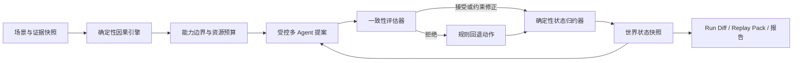
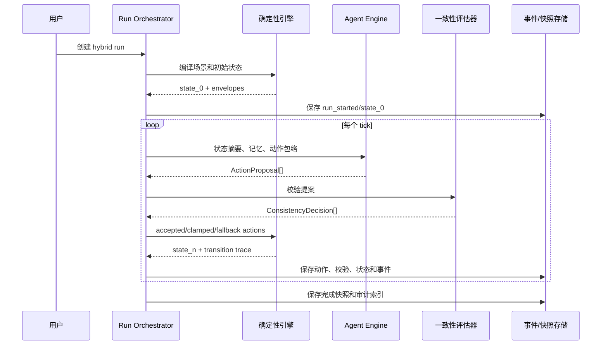

# WorldPulse 下一阶段架构升级方案

日期：2026-07-04  
状态：规划稿，可直接拆分为实施任务  
目标：在保留确定性因果引擎、War Room、Run Diff、Replay Pack 和中文指挥台的前提下，引入受控多 Agent 引擎与一致性评估器。

## 1. 执行结论

WorldPulse 不应复制 MiroFish，也不应把现有规则 Agent 直接替换为 LLM Agent。下一阶段应采用“确定性内核 + 受控多 Agent + 一致性评估器”的混合架构：



核心原则：

1. 风险数值、供应链压力、资源消耗和世界状态只由确定性代码写入。
2. LLM Agent 只能提交结构化动作提案，不能直接修改状态。
3. 每个动作必须经过能力、资源、联盟、时间、因果和证据约束检查。
4. Replay 是重放已接受动作，不承诺重新调用 LLM 后逐字节一致。
5. 首版采用模块化单体和独立本地 worker，不立即引入微服务、Redis、Celery、Zep 或 OASIS。
6. 首版控制在 20 个核心 Agent；验证成本、稳定性和约束覆盖后再扩展到 100。

## 2. 已核实的当前状态

### 2.1 WorldPulse

代码证据：

- `app/services/war_room_engine.py` 中的 `run_war_room()` 已形成完整确定性流水线：场景解析、供应链压力、国家风险、时间线、决策、热力图、因果图和 UI state。
- `app/services/projects.py` 已支持项目运行、War Room workspace、Run Diff、Replay Pack、图谱编辑、报告和聊天。
- `app/services/project_store.py` 使用 SQLite，当前核心表为 `research_projects`、`research_runs`、`causal_graph_snapshots`、`ai_reports` 和 `chat_messages`。
- `app/services/llm_client.py` 已提供 OpenAI-compatible 的 `call_llm_json(messages, schema_hint, timeout)` 和 provider fallback。
- `frontend/src/views/ResearchWorkspaceView.vue` 已支持 War Room 五大模块，但单文件约 2200 行。
- 当前测试基线为 43 项 pytest 全部通过，Vue/Vite 生产构建通过。

当前优点：

- 同一输入得到同一数值输出。
- 已有反事实比较、运行快照、审计包和证据引用。
- 无 LLM/API key 时核心 War Room 仍可运行。
- 产品定位是策略沙盘，不把结果包装为现实预测。

当前结构性问题：

- `war_room_engine.py` 同时承担领域计算、Agent 规则、UI 合同和中文文案。
- `projects.py` 同时承担应用编排、SQL 持久化、Diff、Replay Pack、报告和 workspace 投影。
- `ResearchWorkspaceView.vue` 同时承担路由页、状态管理、D3、运行控制和七个模块 UI。
- `ResearchRun` 只有 `created/completed` 式同步结果，不足以表达长任务的排队、准备、运行、暂停、取消、失败和恢复。
- Agent 决策是一次性规则分类，没有多轮交互、记忆、联盟协商或舆论扩散。
- 大量结果存储在 JSON blob 中，适合 MVP，但缺少逐动作、逐约束、逐模型调用的审计记录。
- 当前 War Room 相关代码仍在未提交工作区中；在架构升级前必须先形成可回滚基线。

### 2.2 MiroFish

本地 `MiroFish-main` 和官方仓库显示其主流程为：

```text
上传材料
→ 本体与实体抽取
→ Zep GraphRAG
→ 人格化 Agent Profile
→ OASIS Twitter/Reddit 并行模拟
→ 动作与时间线
→ ReportAgent 工具调用和 Agent 采访
→ 报告与深度互动
```

值得借鉴的机制：

- 图谱构建、环境准备、模拟、报告和互动的分阶段产品流程。
- `SimulationRunState` 对轮次、平台、进度、动作数、错误和进程的显式建模。
- 动作日志、时间线、Agent 统计、停止接口和运行状态接口。
- ReportAgent 通过有限工具读取模拟结果，而不是一次性把全部上下文塞给模型。
- Agent profile、模拟配置和报告生成均有文件化中间产物，便于诊断。

不应照搬的部分：

- Twitter/Reddit 是 MiroFish 的社会模拟载体，不是 WorldPulse 的国家能力与供应链模型。
- Zep Cloud 和 OASIS 会引入强外部依赖、费用、运行复杂度和供应商约束。
- 子进程、线程、JSON 文件和轮询的组合在单机可用，但不适合作为 WorldPulse 长期运行内核。
- LLM 贯穿本体、角色、配置和报告会累积未经校验的假设。
- MiroFish 采用 AGPL-3.0，WorldPulse 采用 MIT。只能做 clean-room 架构借鉴，不能直接复制其代码。

## 3. 能力对比与产品定位

| 维度 | WorldPulse 当前 | MiroFish | WorldPulse 目标 |
|---|---|---|---|
| 核心定位 | 地缘风险因果沙盘 | 通用群体智能模拟 | 可审计地缘战略多 Agent 因果沙盘 |
| 数值内核 | 确定性规则 | 主要由 LLM/OASIS 行为产生 | 确定性规则保持唯一状态写入权 |
| Agent | 规则决策器 | 人格、记忆、社交行为 | 受能力与资源约束的国家/联盟/舆论 Agent |
| 输入 | 固定场景 schema | 文档与自然语言 | 结构化场景优先，材料提取为可选编译层 |
| 记忆 | 运行快照 | Zep 长期记忆 | 本地可审计记忆接口，后端可替换 |
| 生命周期 | 同步运行 | prepare/start/stop/status | 异步、可取消、可恢复、事件流 |
| 审计 | Run Diff、Replay Pack | 动作日志、报告日志 | 动作、约束、模型、状态转换全链审计 |
| 复现 | 强 | 弱 | 数值复现强，Agent 重放强，Agent 重采样不承诺一致 |
| 外部依赖 | 低 | 高 | 默认低，可选 LLM |
| 风险表述 | 策略沙盘 | “预测万物” | 保持保守、证据化和不确定性表达 |

目标产品表述：

> WorldPulse 是一个可审计、可复现、面向地缘战略的专业多 Agent 因果沙盘。确定性引擎负责“世界能发生什么”，受控 Agent 负责“参与者可能选择什么”，一致性评估器负责“这些选择是否可行”。

## 4. 目标架构

### 4.1 保持模块化单体

第一阶段保持一个 FastAPI 应用、一个 Vue 应用和一个 SQLite 数据库，但拆分清晰边界：

```text
app/
  domain/
    scenario/
    world_state/
    causal/
    supply_chain/
    agents/
    consistency/
    replay/
  application/
    commands/
    queries/
    orchestration/
  infrastructure/
    persistence/
    llm/
    worker/
    evidence/
  api/
    v1/
    v2/
```

边界规则：

- `domain` 不依赖 FastAPI、SQLite、HTTP 或 Vue。
- `application` 只编排领域端口，不写 SQL，不拼 UI 文案。
- `infrastructure` 实现仓储、LLM、worker 和证据适配器。
- API 层只做验证、鉴权预留、命令提交和 DTO 映射。
- UI 展示合同由 query/projector 生成，不放在确定性计算函数中。

### 4.2 三个核心引擎

#### A. Deterministic Causal Engine

职责：

- 接收 `ScenarioSpec` 和 `WorldStateSnapshot`。
- 计算国家能力、供应链容量、资源预算、风险分解、因果滞后和硬约束。
- 产生 Agent 可见的 `ActionEnvelope`。
- 在动作被接受后，通过纯函数 `reduce(state, accepted_actions)` 生成下一状态。

必须保持：

- 无 LLM 依赖。
- 给定相同输入、规则版本和 seed，输出稳定。
- 每个数值都能追溯公式、输入字段和规则版本。

#### B. Controlled Multi-Agent Engine

职责：

- 为国家、联盟、组织和舆论群体构建有限上下文。
- 让 Agent 提交外交、联盟、制裁、舆论和解释类动作。
- 支持多轮协商与消息传播。
- 输出结构化 `AgentActionProposal`，不输出最终世界状态。

首版 Agent 类型：

- 10 个国家/经济体 Agent：沿用当前 War Room 国家集合。
- 3 个联盟/协调体 Agent：安全联盟、贸易集团、能源协调体。
- 4 个舆论 Agent：国内公众、市场叙事、国际媒体、行业利益相关者。
- 3 个中介 Agent：外交调停、金融稳定、供应链协调。

首版总量固定 20 个。100 Agent 仅作为后续性能目标。

#### C. Consistency Evaluator

职责：

- 对每个动作提案执行确定性约束检查。
- 生成机器可读的 `ConsistencyDecision`。
- 决定 `accept`、`clamp`、`reject` 或 `fallback`。
- 记录违反的规则、证据、修正前后值和影响。

约束类别：

| 类别 | 示例 | 处理 |
|---|---|---|
| capability | 无对应能力却提出大规模行动 | reject |
| resource | 预算、库存、运力或政治资本超限 | clamp/reject |
| logistics | 供应链路径不存在或恢复时间过短 | reject |
| temporal | 动作违反最小准备时间和因果滞后 | defer |
| alliance | 与已记录承诺冲突 | reject 或形成退出联盟动作 |
| policy | 同一主体同轮提交互斥政策 | choose-one |
| causal | 动作声称的数值影响超出规则包络 | clamp |
| evidence | 事实主张无证据 | 标记 unverified，不进入数值内核 |
| state | 引用过期或不存在的世界状态 | reject/retry |

处理顺序：

```text
schema validation
→ identity/state validation
→ capability/resource checks
→ temporal/logistics checks
→ alliance/policy checks
→ causal envelope checks
→ evidence classification
→ accept/clamp/reject/fallback
```

硬违规不让 LLM 无限自我修复。最多允许一次结构化修复；仍失败则使用规则回退动作。

### 4.3 混合运行循环



Tick 不是固定等于现实一天。首版使用阶段化 tick：

1. `shock`：初始冲击。
2. `assessment`：各方评估。
3. `response`：外交、联盟、制裁和资源调整。
4. `propagation`：舆论与二阶供应链传播。
5. `stabilization`：缓解或升级。
6. `review`：生成最终状态和观察项。

这样比按 30 天逐日调用 20 个 Agent 更可控。时间线仍由确定性引擎映射到现实日。

## 5. 核心数据合同

### 5.1 ScenarioSpec

```json
{
  "schema_version": "scenario.v2",
  "scenario_key": "strait_blockade_30d",
  "duration_days": 30,
  "intensity": 0.65,
  "propagation": 0.42,
  "target_countries": ["CHN", "TWN", "USA"],
  "target_chains": ["chips", "shipping"],
  "policy_actions": [],
  "evidence_snapshot_id": "artifact_...",
  "engine_mode": "hybrid",
  "seed": 42
}
```

### 5.2 AgentActionProposal

```json
{
  "schema_version": "agent-action.v1",
  "proposal_id": "proposal_...",
  "run_id": "run_...",
  "tick": 2,
  "agent_id": "country:USA",
  "action_type": "diplomatic_signal",
  "targets": ["country:CHN", "country:TWN"],
  "parameters": {
    "intensity": 0.45,
    "duration_days": 7
  },
  "public_message": "建议保持危机沟通渠道。",
  "rationale_summary": "在维持威慑的同时降低误判概率。",
  "expected_effects": [
    {"metric": "military_pressure", "direction": "down", "magnitude": 0.12}
  ],
  "evidence_refs": ["evidence_..."],
  "confidence": 0.71
}
```

禁止字段：

- 直接写入 `risk_score`、`capacity`、`stability` 或任何世界状态。
- 自由文本中的秘密推理过程。
- 未声明主体和目标的动作。

### 5.3 ActionEnvelope

```json
{
  "agent_id": "country:USA",
  "allowed_action_types": ["diplomatic_signal", "alliance_consultation", "sanction_proposal"],
  "resource_limits": {
    "political_capital": 40,
    "financial_commitment": 25
  },
  "effect_bounds": {
    "military_pressure": [-8, 12],
    "trade_pressure": [-4, 10]
  },
  "earliest_effect_day": 2,
  "forbidden_targets": []
}
```

### 5.4 ConsistencyDecision

```json
{
  "proposal_id": "proposal_...",
  "status": "clamp",
  "violations": [
    {
      "rule_id": "causal.effect-bound.v1",
      "severity": "soft",
      "field": "expected_effects[0].magnitude",
      "observed": 0.40,
      "allowed": 0.12
    }
  ],
  "normalized_action": {},
  "fallback_action": null,
  "evaluator_version": "consistency.v1"
}
```

### 5.5 Run reproducibility

每个 run 固定记录：

- scenario schema/version 和完整输入。
- deterministic rule pack version。
- consistency evaluator version。
- seed。
- Agent profile version。
- prompt template hash。
- provider、model 和 sampling 参数。
- 每个模型调用的输入摘要 hash、结构化输出、耗时、token/费用。
- 每个状态快照和 artifact 的 SHA-256。

三种执行模式：

| 模式 | 行为 |
|---|---|
| `deterministic` | 不调用 LLM，保持当前能力 |
| `hybrid_recorded` | 调用 Agent，保存全部结构化动作，可精确重放 |
| `hybrid_resample` | 从相同初始状态重新调用 Agent，用于探索分支，不承诺输出一致 |

## 6. 持久化与运行生命周期

### 6.1 兼容策略

不删除现有表，不立刻重写历史数据：

- `research_projects` 保持项目入口。
- `research_runs` 保持前端兼容的完成结果投影。
- `causal_graph_snapshots`、`ai_reports`、`chat_messages` 继续可读。
- 新的长任务和审计数据写入扩展表。

### 6.2 新增表

#### `run_jobs`

- `run_id`
- `project_id`
- `engine_mode`
- `status`
- `current_phase`
- `progress`
- `seed`
- `parent_run_id`
- `scenario_artifact_id`
- `rule_pack_version`
- `agent_pack_version`
- `evaluator_version`
- `created_at/started_at/updated_at/completed_at`
- `cancel_requested_at`
- `error_code/error_message`

状态机：

```text
queued -> preparing -> running -> completed
                   \-> paused -> running
                   \-> cancelling -> cancelled
                   \-> failed -> queued (explicit retry creates attempt)
```

#### `run_events`

Append-only：

- `run_id`
- `seq`
- `event_type`
- `phase`
- `tick`
- `payload`
- `created_at`

`(run_id, seq)` 唯一，用于 SSE 断线续传和审计。

#### `run_artifacts`

- `artifact_id`
- `run_id`
- `artifact_type`
- `schema_version`
- `content_json`
- `sha256`
- `created_at`

artifact 类型包括 scenario、world_state、action_envelope、agent_context、report、replay_manifest。

#### `agent_actions`

- proposal 和 normalized action。
- accept/clamp/reject/fallback 状态。
- tick、主体、目标、动作类型。
- 模型调用 ID。

#### `consistency_checks`

- proposal ID。
- rule ID、severity、status。
- observed/allowed。
- evaluation trace。

#### `model_invocations`

- provider/model。
- prompt template hash 和输入 hash。
- sampling 配置。
- latency、token usage、estimated cost。
- structured output。
- error/retry/fallback。

不保存模型隐藏思维链或 `reasoning_content`。

### 6.3 Worker

首版使用单独 Python worker 进程：

- API 只创建 `run_jobs`，不在请求线程运行 hybrid simulation。
- worker 用 SQLite 原子领取一个 queued job。
- 每个 run 按 tick 落盘，进程重启后从最近完整 state artifact 恢复。
- cancel 在 tick 边界生效。
- 同一 SQLite 实例默认并发 1 个 hybrid run；确定性 run 可继续同步。
- 通过配置预留 `RunExecutor` 接口，未来可替换为 Redis/Celery，但第一阶段不引入。

SQLite 要求：

- 开启 WAL。
- 设置 busy timeout。
- 写事务保持短小。
- worker 使用独立连接。
- 状态领取使用条件更新，防止重复执行。

## 7. API v2

保留全部 v1 API。新增：

```text
POST /api/v2/projects/{project_id}/runs
GET  /api/v2/runs/{run_id}
GET  /api/v2/runs/{run_id}/events
GET  /api/v2/runs/{run_id}/events/stream
POST /api/v2/runs/{run_id}/cancel
POST /api/v2/runs/{run_id}/resume
POST /api/v2/runs/{run_id}/retry
GET  /api/v2/runs/{run_id}/artifacts
GET  /api/v2/runs/{run_id}/audit
GET  /api/v2/runs/{run_id}/agents
GET  /api/v2/runs/{run_id}/actions
GET  /api/v2/runs/{run_id}/consistency
```

创建 run：

```json
{
  "engine_mode": "hybrid_recorded",
  "scenario": {},
  "agent_config": {
    "pack": "geopolitics-core-20.v1",
    "max_ticks": 6,
    "max_parallel_calls": 4,
    "repair_attempts": 1
  },
  "seed": 42,
  "parent_run_id": null
}
```

兼容规则：

- 现有 `POST /api/projects/{id}/war-room/run` 保持同步确定性行为。
- UI 默认仍可选择“确定性推演”。
- hybrid 运行完成后，将最终结果投影到 `research_runs`，因此现有 workspace、Diff 和 Replay Pack 可继续工作。
- v2 错误必须返回稳定 `error_code`，不能只返回自由文本。

## 8. Agent、记忆与证据

### 8.1 Agent profile

Agent profile 分为三层：

1. `identity`：国家/组织身份与稳定属性。
2. `capabilities`：来自确定性引擎的能力、资源和限制。
3. `policy_memory`：本 run 中已采取动作、承诺、收到消息和结果。

Profile 是版本化数据，不由 LLM 自由生成国家能力。

### 8.2 MemoryStore

定义接口，不绑定 Zep：

```python
class MemoryStore(Protocol):
    def append(self, run_id: str, agent_id: str, event: MemoryEvent) -> None: ...
    def retrieve(self, run_id: str, agent_id: str, query: MemoryQuery) -> list[MemoryItem]: ...
    def summarize(self, run_id: str, agent_id: str, through_tick: int) -> MemorySummary: ...
```

首版 SQLite 实现：

- 当前 run 内记忆。
- 最近 N 个相关事件。
- 已接受的承诺和动作。
- 由确定性代码生成的状态摘要。

暂不实现跨项目“长期人格记忆”，防止历史错误污染新场景。

### 8.3 Evidence

材料上传不是第一实施阶段，但必须预留：

```text
原始材料
→ 文本提取
→ evidence item
→ 实体/关系候选
→ 人工确认或规则校验
→ scenario compiler
```

LLM 提取的实体和关系默认是 `candidate`，不能自动变成确定性事实。每个 evidence item 记录来源、时间、抽取器版本和置信度。

## 9. 前端升级

保留现有中文指挥台视觉，先拆组件再增加 Agent 功能。

建议组件边界：

```text
views/WarRoomWorkspaceView.vue
components/war-room/
  WarRoomShell.vue
  WarRoomTopNav.vue
  OverviewPanel.vue
  ScenarioBuilder.vue
  AgentAnalysisPanel.vue
  CausalGraphPanel.vue
  DataAuditPanel.vue
  ReplayPanel.vue
  RunControlPanel.vue
  AgentConversationPanel.vue
  ConsistencyAuditPanel.vue
composables/
  useWarRoomRun.ts
  useRunEventStream.ts
  useScenarioDraft.ts
  useGraphSelection.ts
  useReplay.ts
```

新增交互：

- 引擎模式选择：确定性 / 混合 Agent。
- hybrid run 的排队、阶段、tick、进度、取消、恢复和失败重试。
- Agent 对话和联盟协商时间线。
- 每个动作显示“提案 → 约束检查 → 最终接受动作”。
- 一致性面板显示 reject/clamp/fallback 和规则编号。
- 数据中台新增 model invocation、token/成本、artifact hash 和 rule version。
- Replay Pack 区分“重放记录动作”和“重新采样 Agent”。

禁止：

- 把原始 LLM 文本直接渲染为事实结论。
- 在前端自行重算风险或约束。
- 将 SSE 事件当作最终状态；最终状态始终从 run query 读取。

## 10. 分阶段实施计划

### Phase 0：冻结和发布当前 War Room 基线

目标：先把当前已验证能力变成可回滚版本。

实施：

- 审查约 7000 行未提交修改，移除运行日志、DOM dump、QA 截图等临时产物。
- 扩充 `.gitignore`，加入根目录 `*.log`、前端运行日志和本地 QA 输出目录。
- 执行 API key 扫描。
- 更新 README：War Room、五大模块、Run Diff、Replay Pack、启动方式和免责声明。
- 建立 `docs/architecture`、ADR 和数据合同目录。
- 提交并打 `v0.3.0-war-room-baseline` 标签。

参考：

- `tests/test_war_room.py`
- `frontend/src/views/ResearchWorkspaceView.vue`
- `app/services/war_room_engine.py`

验证：

- 43 项 pytest 通过。
- 前端 build 通过。
- `git status` 无日志、密钥、数据库和构建产物。
- 现有 War Room 浏览器回归通过。

防错：

- 不在未提交巨型 diff 上继续堆混合引擎。
- 不把 `.env`、数据库或真实 key 纳入版本控制。

### Phase 1：无行为变化的模块边界重构

目标：拆分巨型文件，同时保持 API 和结果逐字段不变。

实施：

- 将 `war_room_engine.py` 拆为 scenario、rules、timeline、decisions、graph 和 projection。
- 将 `projects.py` 拆为 command service、query service、diff service、replay service 和 repositories。
- 将 Pydantic 模型按 bounded context 拆文件，并从旧入口 re-export 保持 import 兼容。
- 将前端单页拆为 shell、模块组件和 composables。
- 为当前三个预设建立 golden snapshot 测试。

参考：

- 复制现有 `run_war_room()` 调用顺序，不改变公式。
- 复制现有 `compare_project_runs()` 与 `war_room_replay_pack()` 的输出合同。
- 复制现有前端 API 函数，不改变 v1 URL。

验证：

- 旧测试全部通过。
- 三个预设的规范化 JSON snapshot 无差异。
- 前端五个路由 URL、模块行为和浏览器前进后退无变化。

防错：

- 不在重构阶段引入 Agent、队列或新数据库行为。
- 不同时重命名 API 字段和移动代码。

### Phase 2：异步 Run Lifecycle 与审计事件存储

目标：建立长任务运行基础，但先只运行确定性引擎。

实施：

- 新增 `run_jobs`、`run_events`、`run_artifacts` 和迁移版本表。
- 实现 `RunRepository`、`ArtifactRepository`、`EventRepository`。
- 实现 worker、状态机、tick checkpoint、cancel 和 resume。
- 新增 v2 run/status/events/SSE/control API。
- 完成时投影到现有 `research_runs`。
- 在 UI 增加运行控制和事件流，不改变确定性结果。

参考：

- 状态字段可参考 MiroFish 的 `SimulationRunState`，但重新实现，不复制 AGPL 代码。
- 沿用 WorldPulse 的 SQLite `connect()` 模式，并增加 WAL、busy timeout 和迁移版本。

验证：

- API 重启后 queued/running run 可恢复。
- cancel 在阶段边界生效。
- SSE 使用 `Last-Event-ID` 或 `after_seq` 恢复，无事件丢失。
- worker 崩溃后不会重复生成两个完成投影。
- v1 同步 API 仍通过。

防错：

- 不用 FastAPI `BackgroundTasks` 承担可恢复长任务。
- 不以进程内字典作为运行真相。
- 不先引入 Redis/Celery。

### Phase 3：Agent 合同、模型网关和 20 Agent 包

目标：让 Agent 产生受控结构化提案，暂不改变世界状态。

实施：

- 建立 `AgentProfile`、`AgentContext`、`ActionEnvelope` 和 `AgentActionProposal`。
- 扩展现有 `call_llm_json()`，增加 invocation ID、prompt hash、usage、重试原因和结构验证。
- 建立 `AgentPack` 与 `AgentRuntime` 接口。
- 实现 20 Agent 的版本化 profile。
- 每个阶段只激活相关 Agent，避免 20×6 次固定全量调用。
- 保存 proposal 和 model invocation，运行结果仍采用确定性动作。

参考：

- LLM 入口只使用现有 `app/services/llm_client.py` 的 OpenAI-compatible 调用链。
- MiroFish 的 profile/config 分离仅作为行为参考。

验证：

- 无 key 时 hybrid 创建明确失败或自动降级为 deterministic，不能卡死。
- 每个 proposal 通过 Pydantic schema。
- provider 超时、空 content、非 JSON 和 fallback 有测试。
- 不持久化 `reasoning_content`。
- 单 run token/费用上限可配置并强制执行。

防错：

- 不让 Agent 自定义 action type。
- 不把自然语言 rationale 解析成数值状态。
- 不把 prompt 拼接散落在业务函数中。

### Phase 4：一致性评估器和混合状态归约

目标：让合规 Agent 动作实际影响确定性世界。

实施：

- 建立版本化 Rule Registry。
- 实现 schema、能力、资源、时间、联盟、政策、因果和证据检查。
- 实现 accept/clamp/reject/fallback。
- 将已接受动作送入确定性 reducer。
- 为每次 transition 生成输入、公式、delta 和 rule ID。
- Replay Pack 增加 proposal、check、accepted action 和 transition trace。

参考：

- 当前 `run_war_room()` 是 deterministic baseline。
- 当前 supply chain 和 country override 机制可重构为 reducer 的首批 action handler。
- 当前 Run Diff 继续作为结果比较层。

验证：

- 违反资源上限的动作不能改变状态。
- 超出 effect bound 的动作被 clamp 且审计可见。
- 同样的 recorded actions 重放产生相同 state hash。
- evaluator 关闭时 hybrid run 被拒绝，不允许绕过。
- 所有数值 delta 都能定位到 transition trace。

防错：

- 不让一致性评估器本身依赖 LLM 做最终裁决。
- 不在 reject 后悄悄接受原动作。
- 不允许 UI 或报告修改 accepted action。

### Phase 5：外交、联盟与舆论多轮 MVP

目标：实现用户要求的外交博弈、联盟协商和舆论传播。

实施：

- 支持 Agent-to-Agent message、proposal、commitment、counteroffer 和 withdrawal。
- 建立联盟承诺账本和互斥政策规则。
- Agent 生成叙事文本；传播强度、覆盖和压力变化由确定性 diffusion 模型计算。
- 引入阶段化 6 tick 运行。
- UI 增加协商时间线、网络图、动作详情和一致性审计面板。

验证：

- 联盟承诺冲突被检测。
- 同一 recorded action log 可重放。
- 舆论文本变化不会直接绕过 diffusion 公式改变数值。
- Agent 关闭后同一场景仍可确定性运行。
- 20 Agent 运行在设定的时间、token 和费用预算内。

防错：

- 不用 Twitter/Reddit 行为模型替代地缘领域模型。
- 不把“更有戏剧性”当作模拟质量指标。
- 不以 Agent 发言数量代表有效涌现。

### Phase 6：材料导入、证据图和场景编译

目标：吸收 MiroFish 的通用输入优势，但保持证据约束。

实施：

- 支持 PDF/TXT/Markdown/CSV 的受控上传。
- 生成 evidence item、实体候选、关系候选和 scenario draft。
- 增加人工确认页。
- 只有确认后的实体和关系才能进入 scenario compiler。
- 保留原始文件 hash、抽取器版本和引用定位。

验证：

- 同一材料重复导入去重。
- 未确认候选不进入确定性引擎。
- 引用可定位到原文页码/行。
- 恶意文件名、超大文件和不支持类型被拒绝。

防错：

- 不自动把 LLM 抽取结果升级为事实。
- 不在第一版引入 Zep 作为必须依赖。
- 不允许上传内容覆盖系统规则或 action schema。

### Phase 7：基准、校准、CI 与发布

目标：证明混合架构比单纯 LLM 模拟更可靠。

建立 12 个固定场景：

- 海峡封锁。
- 能源出口中断。
- 粮食减产。
- 芯片供应中断。
- 金融结算限制。
- 海运瓶颈。
- 制裁与反制裁。
- 联盟协调成功/失败。
- 舆论快速扩散。
- 错误信息冲击。
- 外交降级。
- 多重冲击。

核心指标：

- deterministic invariant pass rate = 100%。
- recorded replay state hash match = 100%。
- hard violation leakage = 0。
- consistency reject/clamp/fallback rate。
- action schema success rate。
- run completion/cancel/recovery success rate。
- token、费用、p50/p95 延迟。
- Agent 行为多样性和重复率。
- 与历史案例方向的一致性，仅作为校准，不宣称预测准确率。

CI：

- Python 单元、集成、migration、snapshot、property-based 测试。
- Vue build、组件测试和关键 Playwright 流程。
- 密钥扫描、依赖审计、许可证检查。
- Docker build 和启动 smoke test。

## 11. 推荐任务拆分

按顺序创建以下 implementation slices：

1. `baseline-release`
2. `domain-module-split`
3. `frontend-workspace-split`
4. `run-lifecycle-schema`
5. `local-worker-and-sse`
6. `agent-contracts-and-model-audit`
7. `core-20-agent-pack`
8. `consistency-rule-registry`
9. `deterministic-action-reducer`
10. `hybrid-orchestrator`
11. `negotiation-and-opinion`
12. `hybrid-ui-and-audit`
13. `evidence-ingestion`
14. `benchmark-and-release`

每个 slice 必须单独可回滚，不允许跨越 Phase 同时提交。

## 12. 关键风险与控制

| 风险 | 影响 | 控制 |
|---|---|---|
| LLM 幻觉进入数值结果 | 破坏可信度 | LLM 无状态写入权，一致性检查 + reducer |
| Agent 运行成本失控 | 无法本地使用 | 激活集、tick 上限、token/费用预算、缓存 |
| 长任务卡死 | UX 和数据损坏 | 独立 worker、checkpoint、cancel、resume |
| SQLite 并发写锁 | 运行失败 | WAL、短事务、单 hybrid worker |
| Prompt/模型升级导致漂移 | Diff 不可解释 | template hash、model config、recorded replay |
| 规则过严导致全回退 | 无 Agent 价值 | 记录 reject/clamp 指标，按场景校准 |
| 规则过松导致越界 | 假涌现 | hard invariant property tests |
| UI 继续巨型化 | 难维护 | 先拆组件和 composable |
| AGPL 污染 MIT 项目 | 法律风险 | clean-room，不复制 MiroFish 实现 |
| 未提交基线继续膨胀 | 无法回滚 | Phase 0 强制完成 |

## 13. 完成定义

下一阶段架构升级完成必须同时满足：

- 当前确定性 War Room、五大模块、Run Diff 和 Replay Pack 无回归。
- 用户可选择 deterministic 或 hybrid_recorded。
- hybrid run 可排队、查看进度、取消、恢复和失败重试。
- 20 个受控 Agent 能完成 6 阶段协商。
- 每个 Agent 动作都有 proposal、consistency decision 和 accepted action。
- 所有数值由确定性 reducer 生成。
- recorded replay 的最终 state hash 完全一致。
- Replay Pack 包含规则、模型、动作、约束和 transition 审计。
- 无 key 时 deterministic 模式完整可用。
- README、架构文档、CI、Docker 和版本发布同步完成。

## 14. 明确不做

本阶段不做：

- 千级 Agent。
- 真实战争预测。
- 自动政策或投资决策。
- 实时军事情报接入。
- 以 Zep、OASIS、Redis、Celery 为强制依赖。
- 微服务拆分。
- LLM 直接修改风险、供应链或国家能力数值。
- 复制 MiroFish 的 AGPL 实现代码。

## 15. 资料与实现参考

WorldPulse 本地：

- `app/services/war_room_engine.py`
- `app/services/projects.py`
- `app/services/project_store.py`
- `app/services/llm_client.py`
- `app/core/models.py`
- `app/api/routes.py`
- `tests/test_war_room.py`
- `frontend/src/views/ResearchWorkspaceView.vue`

MiroFish 本地：

- `README-ZH.md`
- `backend/app/services/simulation_manager.py`
- `backend/app/services/simulation_runner.py`
- `backend/app/services/simulation_config_generator.py`
- `backend/app/services/oasis_profile_generator.py`
- `backend/app/services/report_agent.py`
- `backend/app/api/simulation.py`
- `backend/pyproject.toml`
- `LICENSE`

外部：

- 官方仓库：https://github.com/666ghj/MiroFish
- 官方发布：https://github.com/666ghj/MiroFish/releases

