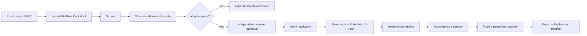

# WorldPulse V1.3 Trust Governance

V1.3 keeps the deterministic War Room engine as the only numeric authority. Governance metadata can select a registered implementation and decide whether a version may be promoted, but it cannot patch a completed result or inject a rejected Agent action into projection.

## Security boundaries

- `WORLDPULSE_AUTH_MODE=local` enables opaque server-side sessions. Only SHA-256 token/CSRF digests are stored.
- Session cookies are HttpOnly and SameSite=Lax; production also requires Secure. CSRF uses a separate readable cookie plus `X-CSRF-Token`, both verified against the stored digest.
- Sessions expire after 30 minutes idle or eight hours absolute time.
- Backend middleware is authoritative for RBAC. UI hiding is only a usability projection.
- Production startup rejects disabled authentication and wildcard CORS.
- Security audit details pass through structured secret redaction and never intentionally include passwords, cookies, API keys, prompts, or provider responses.

## Rule Pack invariants

- States are `draft`, `candidate`, `active`, and `retired`.
- A submitted draft requires a completed, hash-verified calibration artifact and an independent reviewer.
- A creator cannot approve their own pack. Activation is serialized with `BEGIN IMMEDIATE`, retires the previous active pack, and never rewrites historical runs.
- A retry pins the original Rule Pack. New runs read the active Rule Pack at creation time.
- The current registry accepts only implementation versions compiled into this release; an unknown implementation version fails calibration.

## Calibration interpretation

The initial 30-case corpus covers strait, energy, food, sanctions, trade, and finance scenarios. It is a frozen V1.2 regression corpus with versioned inputs, labels, evidence references, cutoff dates, and hashes. It validates determinism and governance plumbing; it is not independent historical ground truth. V1.4 registers it as immutable, cutoff-correct internal evidence; independent external evidence remains a separately governed future ingestion task.

Promotion gates require 100% deterministic regression, 100% critical violation recall, zero critical false accepts, at least 70% direction accuracy, at least 60% Top-3 overlap, no material regression above five percentage points, and explicit reviewer approval.

## Review invariant

Review Decisions are append-only. `approve_promotion` is accepted only for Rule Pack promotion cases. Agent action cases support acknowledgement or revision requests; they can never convert `rejected`, `constrained`, or `expired` into projected actions. The proposal or Rule Pack must change and pass the evaluator again.
