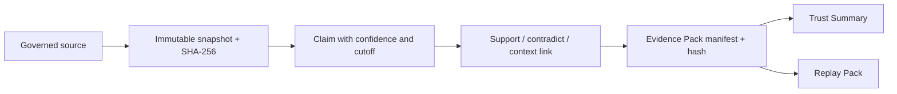

# WorldPulse V1.4 Evidence Registry

V1.4 adds a provenance control plane around the existing deterministic engine. It does not change risk values, supply-chain pressure, Run Diff, lifecycle states, Rule Pack semantics, or Agent admission. Its purpose is to make every report conclusion and replay artifact traceable to immutable, cutoff-correct local evidence.



## Invariants

- Snapshots are append-only. There is no update endpoint; a changed payload creates a new content hash and snapshot.
- `observed_at` must not be later than `cutoff_at`. Claims and packs cannot reference evidence newer than their own cutoff.
- Snapshot integrity is recomputed from canonical JSON. Pack integrity is recomputed from its canonical manifest. A mismatch is surfaced as failed and pack reads return HTTP 409.
- Project synchronization reads only stored `research_runs`, `causal_graph_snapshots`, `ai_reports`, and their citations. It does not call an Agent, LLM, browser, or data provider.
- Model prose is registered as an explanatory report snapshot. It is not promoted to deterministic or external ground truth.
- Calibration corpus synchronization preserves the original case cutoff and case hash. It remains a frozen internal benchmark, not independent historical truth.
- Existing v1, v2, and v3 APIs remain compatible. Evidence capability lives under `/api/v4`.

## Storage model

- `evidence_sources`: governed locator, publisher, health status, trust tier, and source metadata.
- `evidence_snapshots`: immutable canonical content, searchable text, observed/cutoff/capture times, and SHA-256.
- `evidence_claims`: versioned statement, confidence, validity window, cutoff, and claim hash.
- `evidence_links`: append-only relation between a claim and snapshot with citation metadata.
- `evidence_packs` and `evidence_pack_items`: frozen project/run manifest and included lineage.

SQLite indexes support project, category, and cutoff filtering. V1.4 deliberately avoids an FTS-specific dependency so the schema remains portable to the planned PostgreSQL migration.

## API surface

```text
GET  /api/v4/evidence/sources
POST /api/v4/evidence/sources
GET  /api/v4/evidence/sources/{source_id}
POST /api/v4/evidence/snapshots
GET  /api/v4/evidence/snapshots/{snapshot_id}
POST /api/v4/evidence/claims
GET  /api/v4/evidence/claims/{claim_id}
GET  /api/v4/evidence/search
POST /api/v4/evidence/packs
GET  /api/v4/evidence/packs/{pack_id}
POST /api/v4/evidence/calibration/sync
POST /api/v4/projects/{project_id}/evidence/sync
GET  /api/v4/projects/{project_id}/evidence-summary
```

Reads are available to all authenticated roles. Writes use the existing project-write/calibration permissions, so only administrators and analysts can create or synchronize project evidence. The backend remains authoritative; frontend control visibility is not authorization.

## Operational flow

1. Apply migration `0003_v14_evidence_registry` using `python -m app.manage migrate`.
2. Run or open a completed War Room project.
3. Open the Evidence Center and synchronize the selected run.
4. Inspect integrity, cutoff safety, source health, snapshots, claims, and citation coverage.
5. Freeze an Evidence Pack. Replay Pack exports will include the latest matching evidence manifest.
6. If integrity fails, treat reports and packs as fail-closed and investigate the stored hash mismatch.

V1.5 should move this same contract to PostgreSQL and add organization-scale concurrency. External connectors should be introduced only with source-specific capture policies, licensing metadata, and reproducible cutoff snapshots.
