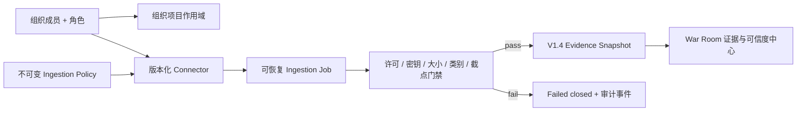

# WorldPulse V1.5：组织级运行与受控数据接入

V1.5 在 V1.4 Evidence Registry 外增加组织和数据接入控制面。它不改变确定性规则引擎，也不允许连接器、Agent 或 UI 改写风险、供应链压力、Run Diff 或 Replay Pack。



## 不变量

- 组织权限由后端执行。前端隐藏按钮不是授权机制。
- 旧数据库、旧项目和旧用户迁移到 `org_default`；旧 v1-v4 URL 与响应模型不变。
- 认证模式下，`X-WorldPulse-Org` 选择当前组织；没有该头时稳定回落到 `org_default`，而不是按名称随机选择。
- v5 组织项目通过组织专用端点创建和列出。旧项目端点在认证模式下应用相同资源作用域。
- 生命周期 run 继承其 project 的组织作用域；知道 run ID 不能绕过组织门禁。
- Connector 配置不得保存 password、secret、token、API key、Authorization 或 Cookie。V1.5 只接受 `manual_json`，不在服务内持有第三方凭据。
- Policy 和 Connector 使用稳定 Hash；完成任务生成 `ingestion-manifest.v1`，固定 policy、connector 和每条 Evidence Snapshot 的 Hash。
- 所有记录在第一次证据写入前整体校验。任一记录违反策略，任务 fail-closed。
- `observed_at > cutoff_at` 永远拒绝；Replay 和报告只能读取已经冻结的快照。
- queued 任务可在写入前取消；failed/cancelled 重试创建新 job 并保留 `parent_job_id`，不覆盖旧审计链。

## 存储边界

- `organizations`、`organization_members`：单一组织目录与成员角色。
- `organization_resources`：project、connector、evidence source/snapshot 等资源归属。
- `ingestion_policies`：不可变门禁 Manifest 和 Hash。
- `data_connectors`：无密钥连接器元数据、许可与配置 Hash。
- `ingestion_jobs`、`ingestion_events`、`ingestion_event_counters`：任务状态和单调事件序列。
- `ingestion_records`：输入记录 Hash 到 Evidence Snapshot 的映射。

迁移 `0004_v15_organization_ingestion` 对已有用户、项目和证据来源进行默认组织回填。正常项目创建会在同一数据库事务内写入项目与作用域；兼容层仅对没有任何归属的旧式直接插入项目补记默认作用域。

## 执行模型

API 可对小型手工批次执行一次有界同步处理；正式持续运行使用：

```text
python -m app.workers.ingestion_worker
python -m app.workers.ingestion_worker --once
```

Worker 领取最早 queued job。V1.5 仍定位于单节点、5–25 人内部团队；没有分布式 lease，也不承诺硬多租户安全边界。需要跨组织强隔离时，应使用独立部署/数据库，直到后续版本完成租户级密钥、配额和渗透门禁。

## PostgreSQL 边界

设置 `WORLDPULSE_DATABASE_URL=postgresql://...` 后，统一 `project_store` 使用 psycopg 连接、qmark 参数适配和同一组编号迁移。SQLite 仍是默认值。PostgreSQL 模式不引入新的业务表或第二套 ORM 模型，避免两个后端产生不同合同。
