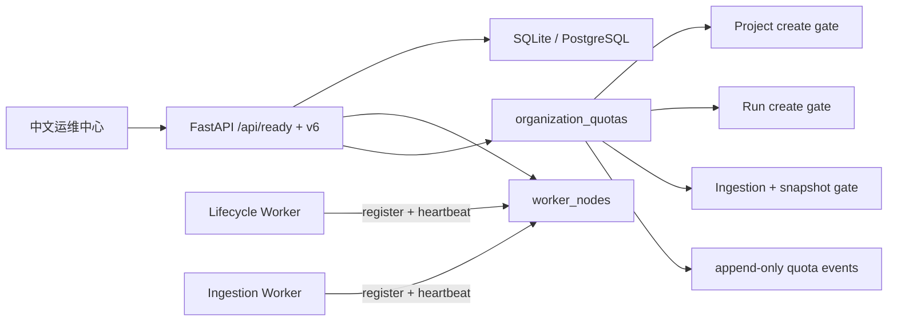

# WorldPulse V1.7：生产运维控制平面

V1.7 在 V1.6 的 PostgreSQL、组织隔离和双 worker 基线上补齐运行控制。它不增加 Agent 数量，不接外部网络连接器，也不改变确定性风险、供应链压力、Run Diff、Replay Pack 或 v1-v5 API。

## 核心不变量

- `GET /api/health` 是 liveness，只说明 HTTP 进程可以响应。
- `GET /api/ready` 检查数据库/迁移、active Rule Pack、队列和 worker 容量。默认缺少 worker 时为 `degraded` 且返回 200；`WORLDPULSE_REQUIRE_WORKERS=1` 时缺少任一 worker 为 `not_ready` 并返回 503。
- worker 每次进程启动生成或接受稳定 ID，登记主机、PID、版本、心跳租约、当前任务和完成计数。过期租约只投影为 `stale`，不覆盖原记录。
- SIGINT/SIGTERM 和管理员 drain 都在任务边界停止领取新任务；进行中的确定性阶段不被强杀。
- 配额在业务服务创建路径执行，不能被旧 API 或 UI 绕过。Idempotency-Key 命中已有请求时先返回原任务，不重复占用额度。
- 配额变更只更新当前限额；每次变更同时追加 `organization_quota_events`，不覆盖历史。
- 已完成运行和证据不因后续降低额度而失效，配额只阻止新的资源创建。

## 存储模型

- `worker_nodes`：worker 类型、状态、租约、当前任务、完成数和安全元数据。
- `organization_quotas`：每组织一行当前硬限制。
- `organization_quota_events`：previous/current manifest、操作者和时间的追加审计链。

迁移 `0005_v17_operations_control` 同时支持 SQLite 和 PostgreSQL，并为所有现有组织创建默认配额。SQLite→PostgreSQL 转移顺序扩展为 39 张业务表，仍执行逐表数量与 SHA-256 校验。

## 权限边界

- 所有组织成员可读取本组织运维摘要。
- 只有全局 `admin` 通过 `operations` 权限触发 worker drain。
- 只有具备全局组织管理权限且在目标组织为 owner/admin 的用户可修改配额。
- 前端禁用或隐藏按钮只用于体验；FastAPI 中间件与组织服务执行最终授权。
