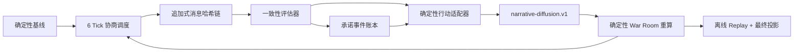

# WorldPulse V1.8：受控多轮外交博弈

V1.8 在 V1.7 运维控制平面之上增加 12 Agent、6 Tick 的只读可观察协商运行时。Agent 只产生结构化定性消息；一致性评估器决定准入，版本化适配器和确定性 War Room 引擎继续独占风险、供应链压力与舆论压力数值权威。

## 固定边界

- Agent Pack 固定为 6 个国家政策、2 个外交、2 个联盟和 2 个舆论 Agent。
- Tick 对应场景进度 `0/10/23/47/70/100%`；每 Tick 最多 6 个 Agent，完整运行最多 36 次调用。
- 默认 Provider 为确定性 Mock。`AGENT_PROVIDER=deepseek|siliconflow` 显式启用真实 Provider；单次失败按 `AGENT_FALLBACK_MODE` 降级或失败。
- `alliance_request`、`deescalation_offer`、`humanitarian_offer` 必须收到合法接收方接受后才能投影。
- 消息、承诺事件和 Round 均为追加式记录。完成运行可只依赖存储记录验证和 Replay，禁止重新调用 Provider。
- 人工用户在 V1.8 只有观察和场景重跑权限，没有注入消息、强制接受或绕过一致性评估器的接口。

## 持久化与恢复

迁移 `0006_v18_negotiation` 新增 Agent Pack、Session、Round、消息、承诺和承诺事件六张表，并在 `run_jobs` 固定 Agent Pack ID/Hash。每个 Tick 还写入 checkpoint、承诺账本、舆论扩散和 Round Artifact。Worker 中断后从最后一个完成 Tick 继续，只补齐当前 Tick 缺失的 Agent 消息。

舆论扩散固定使用 `narrative-diffusion.v1`：稳定 `-4`、信息 `-1`、强硬 `+3`；区域传播 `0.5×`、全球传播 `0.25×`、同联盟 `1.25×`，传播系数不超过 `1.0`，每国整轮累计限制为 `[-8,+8]`。
