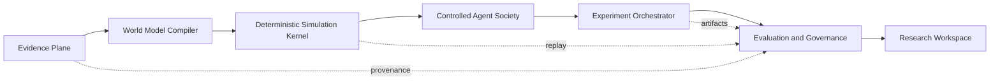

# WorldPulse V2.0 Architecture Program

Status: proposed / Phase 0 baseline

Baseline: `8e4b20d` (`refactor: split workspace coordination`)

This document is the governing plan for the V2.0 architecture program. V2 is a
modular-monolith evolution of V1.12, not a rewrite and not a release claim.
The V1.12 historical benchmark release remains an independent, frozen data
track. No V2 change may fabricate pilot evidence, labels, approvals or blind
plaintext.

## Product and safety invariants

- The deterministic rule engine is the sole authority for risk values,
  supply-chain pressure and country capability.
- Agents may propose controlled diplomatic, narrative, alliance and
  explanation behavior only. They cannot write numeric authority fields.
- Consistency evaluation, action adaptation, commitment ledger and projection
  audit are mandatory for every hybrid or negotiation run.
- Evidence, source, claim, scenario, rule pack, agent pack, artifact, replay
  pack and report retain content-addressed lineage.
- Existing v1-v11 HTTP contracts, database migrations, War Room routes, Run
  Diff, Replay Pack and organization isolation remain compatible.
- Historical benchmark rights decisions, labels and blind labels remain human
  governed and fail closed.
- Reports distinguish source evidence, deterministic derivation, Agent
  observation and uncertainty. WorldPulse must not claim deterministic future
  prediction.

## Target architecture

The first implementation remains one deployable FastAPI application with the
existing lifecycle and ingestion workers. A new service, queue or distributed
runtime requires a measured bottleneck and an ADR; scale is not a reason to
pre-emptively create microservices.

## Bounded contexts and dependency direction

| Context | Owns | May depend on | Must not depend on |
|---|---|---|---|
| Identity & Organization | users, roles, membership, quotas, resource scope | shared contracts | simulation internals |
| Evidence & Ingestion | source, snapshot, claim, pack, connector, acquisition | Identity, shared contracts | Agent provider output |
| Scenario Compiler | extraction, candidates, drafts, Evidence Pack | Evidence, Identity, shared contracts | direct numeric projection |
| World Model | entities, capabilities, resources, relationships, state schema | Evidence, shared contracts | HTTP/UI modules |
| Simulation Runtime | deterministic engine, Agent runtime, consistency, projection, replay | World Model, Evidence, shared contracts | API route code |
| Run Control Plane | jobs, leases, attempts, checkpoints, artifacts, events | Simulation Runtime, Identity, shared contracts | frontend state |
| Evaluation & Governance | suites, batches, metrics, gates, verification, release manifests | Run Control, Evidence, Identity, shared contracts | provider-specific UI |
| Research Workspace | projections, commands, report views, UI orchestration | public application contracts only | database internals |

The dependency rule is directional: API and UI call application ports; application
services call domain contracts and adapters; adapters own storage or provider
details. Direct imports of another context's repository or private helper are a
migration violation.

## Migration sequence

### Phase 0 — architecture and engineering baseline

1. Keep the V1.12 release/data track frozen and record the current test and
   artifact baseline.
2. Add ADRs, this boundary map, a migration register and an automated boundary
   check.
3. Introduce reproducible Python and frontend dependency lock policy without
   changing runtime semantics.
4. Establish lint/type/security/performance baselines. Existing findings are
   tracked debt; they are not hidden by a blanket ignore.

Exit gate: documentation, dependency policy, baseline commands and an
independent local checkpoint exist; V1.12 tests remain green.

### Phase 1 — modular monolith

Start with one slice at a time. The first slice is Evaluation & Governance:
stabilize its public application surface, isolate benchmark tooling from
runtime evaluation, and add contract tests before moving storage code.

Then migrate Evidence & Ingestion, Scenario Compiler, Run Control Plane and
Research Workspace. Compatibility façades remain until all callers use public
ports.

Exit gate: each migrated context has a public contract, independent tests,
dependency checks and no change to v1-v11 behavior.

### Phase 2 — Simulation Kernel V2

Introduce Entity, Component, Environment, deterministic clock, seeded tick,
state delta, event log, checkpoint and replay adapters behind the current run
lifecycle. Existing Golden Scenario hashes and provider-free replay are hard
gates.

### Phase 3 — Evidence Graph and Plugin SDK

Version Entity/Event/Claim/Source/Relationship contracts and plugin manifests.
Port at least three built-in data sources, one Agent provider, one Rule Pack
and one Evaluator to prove the SDK is real.

### Phase 4 — Research Workspace V2

Build the guided flow: research question, evidence, world model, scenario,
experiment matrix, run comparison, uncertainty and cited brief. Preserve old
routes, Chinese product meaning and stable `data-testid` values.

### Phase 5 — observability and measured scale

Add traces and p50/p95 budgets for queue delay, run duration, worker lease
recovery, replay, token cost and database lock waits. Evaluate Ray, Temporal,
Redis or separate services only if those measurements prove the current
PostgreSQL/worker design is the bottleneck.

## Migration register

| Hotspot | First action | Compatibility strategy | Gate |
|---|---|---|---|
| `app/services/evaluation/service.py` | `EvaluationApplicationPort`, pure metrics/Artifact observation and persistence mappers are split; benchmark/runtime coordination remains next | `EvaluationService` façade | V1.11/V1.12 evaluation tests |
| `app/services/evidence_registry.py` | `EvidenceApplicationPort` isolates cross-context callers; pure Hash/integrity mapping and SQL read queries now sit behind an internal Repository while write orchestration migrates incrementally | existing module exports | V1.4/V1.5 evidence tests |
| `app/services/run_lifecycle/repository.py` | isolate job/lease repository from projection helpers | repository import surface | lifecycle, recovery and PostgreSQL tests |
| `app/services/continuous_intelligence/service.py` | split poll, alert and notification applications | v9 API unchanged | monitoring and E2E tests |
| `app/services/scenario_compiler/service.py` | API, extraction Worker, monitoring and CLI now depend on a Scenario Compiler application port; storage/state repositories remain next | existing module exports | V1.9 compiler and extraction tests |
| `app/services/project_app/service.py` | keep façade; move report/workspace/replay ports | `app.services.projects` | project and replay tests |
| `ResearchWorkspacePage.vue` | keep route host; move section hosts and typed API projections | route,文案,`data-testid` | Vitest and Playwright |

## Decision rules

- Every phase gets a separate commit and can be reverted independently.
- No database migration is introduced solely to make a code split prettier.
- No new Agent, action type or external source is added before the relevant
  benchmark and governance contract exists.
- Provider text is untrusted input; it never becomes a system instruction or
  numeric authority.
- No official release tag or remote push is created by this program without
  explicit authorization.
- A security, license, data-rights, public-contract or numeric-authority
  ambiguity stops the phase and requires a decision.
