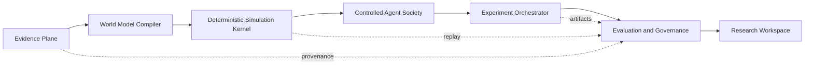

# WorldPulse V2.0 Architecture Program

Status: active / Phase 2 Lifecycle shadow gate passed; production path unchanged

Baseline: `8e4b20d` (`refactor: split workspace coordination`)

This document is the governing plan for the V2.0 architecture program. V2 is a
modular-monolith evolution of V1.12, not a rewrite and not a release claim.
The V1.12 historical benchmark release remains an independent, frozen data
track. No V2 change may fabricate pilot evidence, labels, approvals or blind
plaintext.

## Product and safety invariants

- The deterministic rule engine is the sole authority for risk values,
  supply-chain pressure and country capability.
- Agents may propose controlled diplomatic, narrative, alliance and
  explanation behavior only. They cannot write numeric authority fields.
- Consistency evaluation, action adaptation, commitment ledger and projection
  audit are mandatory for every hybrid or negotiation run.
- Evidence, source, claim, scenario, rule pack, agent pack, artifact, replay
  pack and report retain content-addressed lineage.
- Existing v1-v11 HTTP contracts, database migrations, War Room routes, Run
  Diff, Replay Pack and organization isolation remain compatible.
- Historical benchmark rights decisions, labels and blind labels remain human
  governed and fail closed.
- Reports distinguish source evidence, deterministic derivation, Agent
  observation and uncertainty. WorldPulse must not claim deterministic future
  prediction.

## Target architecture

The first implementation remains one deployable FastAPI application with the
existing lifecycle and ingestion workers. A new service, queue or distributed
runtime requires a measured bottleneck and an ADR; scale is not a reason to
pre-emptively create microservices.

## Bounded contexts and dependency direction

| Context | Owns | May depend on | Must not depend on |
|---|---|---|---|
| Identity & Organization | users, roles, membership, quotas, resource scope | shared contracts | simulation internals |
| Evidence & Ingestion | source, snapshot, claim, pack, connector, acquisition | Identity, shared contracts | Agent provider output |
| Scenario Compiler | extraction, candidates, drafts, Evidence Pack | Evidence, Identity, shared contracts | direct numeric projection |
| World Model | entities, capabilities, resources, relationships, state schema | Evidence, shared contracts | HTTP/UI modules |
| Simulation Runtime | deterministic engine, Agent runtime, consistency, projection, replay | World Model, Evidence, shared contracts | API route code |
| Run Control Plane | jobs, leases, attempts, checkpoints, artifacts, events | Simulation Runtime, Identity, shared contracts | frontend state |
| Evaluation & Governance | suites, batches, metrics, gates, verification, release manifests | Run Control, Evidence, Identity, shared contracts | provider-specific UI |
| Research Workspace | projections, commands, report views, UI orchestration | public application contracts only | database internals |

The dependency rule is directional: API and UI call application ports; application
services call domain contracts and adapters; adapters own storage or provider
details. Direct imports of another context's repository or private helper are a
migration violation.

## Migration sequence

### Phase 0 — architecture and engineering baseline

1. Keep the V1.12 release/data track frozen and record the current test and
   artifact baseline.
2. Add ADRs, this boundary map, a migration register and an automated boundary
   check.
3. Introduce reproducible Python and frontend dependency lock policy without
   changing runtime semantics.
4. Establish lint/type/security/performance baselines. Existing findings are
   tracked debt; they are not hidden by a blanket ignore.

Exit gate: documentation, dependency policy, baseline commands and an
independent local checkpoint exist; V1.12 tests remain green.

### Phase 1 — modular monolith

Migrate one slice at a time. Evaluation & Governance now has a stable public
surface, and the completed context slices are decomposed incrementally behind
compatible application adapters and contract tests.

Simulation Runtime is now the current slice, after World Model, Identity & Organization, Evidence & Ingestion, Scenario Compiler, Run Control Plane and
Research Workspace. Compatibility façades remain until all callers use public
ports.

Exit gate: each migrated context has a public contract, independent tests,
dependency checks and no change to v1-v11 behavior.

### Phase 2 — Simulation Kernel V2

Entry contract: [ADR-0002](adr/0002-simulation-kernel-v2-contract.md). The ADR
must land before any Kernel implementation changes the production path.

Introduce Entity, Component, Environment, deterministic clock, seeded tick,
state delta, event log, checkpoint and replay adapters behind the current run
lifecycle. Existing Golden Scenario hashes and provider-free replay are hard
gates.

### Phase 3 — Evidence Graph and Plugin SDK

Version Entity/Event/Claim/Source/Relationship contracts and plugin manifests.
Port at least three built-in data sources, one Agent provider, one Rule Pack
and one Evaluator to prove the SDK is real.

### Phase 4 — Research Workspace V2

Build the guided flow: research question, evidence, world model, scenario,
experiment matrix, run comparison, uncertainty and cited brief. Preserve old
routes, Chinese product meaning and stable `data-testid` values.

### Phase 5 — observability and measured scale

Add traces and p50/p95 budgets for queue delay, run duration, worker lease
recovery, replay, token cost and database lock waits. Evaluate Ray, Temporal,
Redis or separate services only if those measurements prove the current
PostgreSQL/worker design is the bottleneck.

## Migration register

| Hotspot | First action | Compatibility strategy | Gate |
|---|---|---|---|
| `app/services/simulation_engine.py`, `app/services/war_room_engine.py` | API, AI analysis, Workspace, Lifecycle, Calibration, Hybrid and Negotiation replay now execute deterministic simulations through one typed Simulation Runtime application port | existing engine functions remain numeric authority behind a compatibility adapter; Agent/Consistency/Projection orchestration is unchanged | simulation, Golden War Room, Hybrid, Negotiation and lifecycle reliability tests |
| `app/services/simulation_data.py`, `app/services/war_room/data.py` | API, AI analysis, event digest and deterministic Simulation Engine now use a read-only World Model application port; legacy catalog imports are restricted to an explicit allowlist | existing country-data cache, scenario fixtures, network edges and War Room preset models | simulation API contracts, War Room presets and deterministic engine tests |
| `app/services/auth.py`, `app/services/organizations.py` | main middleware, v3 authentication, v5 organization routes and shared v4-v6/v8-v11 actor resolution use typed Identity and Organization application ports; private imports are now restricted to an explicit migration allowlist | existing auth/organization module exports, Cookie names, expiry, CSRF, permission and role matrices unchanged | V1.3 auth/RBAC, V1.5 organization isolation and V2 port contracts |
| `app/services/evaluation/service.py` | `EvaluationApplicationPort`, pure metrics/Artifact observation and persistence mappers are split; benchmark/runtime coordination remains next | `EvaluationService` façade | V1.11/V1.12 evaluation tests |
| `app/services/evidence_registry.py` | `EvidenceApplicationPort` isolates cross-context callers; pure Hash/integrity mapping and SQL read queries now sit behind an internal Repository while write orchestration migrates incrementally | existing module exports | V1.4/V1.5 evidence tests |
| `app/services/run_lifecycle/repository.py` | API/Worker use the application port; Artifact SQL, integrity hashing, persistence mappers and projection/audit read models are isolated behind compatibility exports | repository import surface | lifecycle, recovery and PostgreSQL tests |
| `app/services/continuous_intelligence/service.py` | split poll, alert and notification applications | v9 API unchanged | monitoring and E2E tests |
| `app/services/scenario_compiler/service.py` | API, extraction Worker, monitoring and CLI now depend on a Scenario Compiler application port; storage/state repositories remain next | existing module exports | V1.9 compiler and extraction tests |
| `app/services/project_app/service.py` | v1/v5 routes use the application port; read views, Replay Pack assembly and research/War Room report construction now have dedicated application adapters | `app.services.projects` | project, report and replay tests |
| `ResearchWorkspacePage.vue` | keep route host; move section hosts and typed API projections | route,文案,`data-testid` | Vitest and Playwright |

### Phase 1 exit audit

The eight Phase 1 contexts now each have a public application contract,
compatibility adapter, focused contract tests and a ratcheted dependency rule:
Identity & Organization, Evidence & Ingestion, Scenario Compiler, World Model,
Simulation Runtime, Run Control Plane, Evaluation & Governance and Research
Workspace. The v7 Negotiation read API and v11 Evaluation verification API also
use public application contracts; `legacy_internal_imports` is empty.

Exit evidence recorded on 2026-08-02:

- backend `267 passed, 5 skipped`; frontend `61 passed` and Playwright `12 passed`;
- 10 numbered migrations and 83 tables verified;
- OpenAPI SHA-256 remains
  `AC73435629D51F555306000B992BF4B99C6A39502FA657D3B8609FB2E297B1AF`;
- Ruff/Mypy V2 ratchet passes across 53 files and the boundary verifier reports
  `legacy_internal_imports: 0`;
- Python runtime/dev dependency audits report no known vulnerabilities, npm
  high-severity audit reports `0 vulnerabilities`, and the staged release
  artifact scan reports 434 tracked files.

Phase 2 Kernel V2 contract implementation has started through ADR-0002 and the
provider-free contract layer. The first migration slice now adds a read-only
`WarRoomRun` to `WorldState` projection and a V1 source / deterministic source /
Kernel state hash correspondence. It requires explicit run, seed and Rule Pack
metadata, excludes Agent/UI projections from numeric authority, and performs no
storage or Provider access. The current production execution path remains
unchanged; no runtime formula or persistence migration is asserted by this
checkpoint.

Phase 2 contract evidence recorded on 2026-08-02:

- backend `315 passed, 5 skipped`; focused Kernel/projection/Event Log/Golden/
  performance suite `63 passed`;
- frontend `61 passed`, production build passed and Playwright `12 passed`;
- 10 numbered migrations and 83 tables verified; OpenAPI SHA-256 remains
  `AC73435629D51F555306000B992BF4B99C6A39502FA657D3B8609FB2E297B1AF`;
- Kernel Ruff/Mypy ratchets pass and the boundary verifier reports
  `legacy_internal_imports: 0` with no forbidden imports;
- Python runtime/dev dependency audits report no known vulnerabilities and npm
  high-severity audit reports `0 vulnerabilities`.

The first local Kernel shadow performance diagnostic uses 100 iterations across
7 repeats on the Windows Python 3.11 development runtime. Measured medians were
`1.208805 ms` for the existing deterministic run, `0.056872 ms` for WorldState
projection, `1.609431 ms` for canonical transition compilation and
`3.103728 ms` for the existing run plus Kernel shadow pipeline. The combined
median ratio was `2.5676x`; although the absolute addition was about `1.9 ms`,
this is diagnostic evidence, not a production performance-gate pass. The
production path remains unchanged until representative multi-tick budgets and
hashing/structural-sharing costs are addressed.

The optimization entry contract is
[ADR-0003](adr/0003-kernel-immutable-state-and-hash-memoization.md): deep
immutability must be established before private hash memoization or
copy-on-write sharing is allowed. Existing canonical hashes remain hard gates;
this optimization cannot change the production path or relax replay checks.

ADR-0003 implementation keeps all three shadow lineage hashes byte-for-byte
unchanged. The post-optimization local medians were `1.195715 ms` for the
legacy run, `0.231523 ms` for deep-frozen projection, `1.196153 ms` for
transition compilation and `3.117027 ms` for the combined shadow pipeline.
Transition compilation improved by about `25.7%`, while recursive freezing
added projection cost; the combined microbenchmark remained effectively flat
against the prior `3.103728 ms`. This strengthens immutability and removes one
hotspot but still does not satisfy the representative production performance
gate.

The next Event Log slice is governed by
[ADR-0004](adr/0004-kernel-multi-tick-shadow-event-log.md). It may expose the
existing deterministic timeline as a provider-free shadow chain, but it cannot
invent intermediate country or supply-chain authority values and cannot persist
new lifecycle artifacts until replay and cost gates pass.

ADR-0004 implementation produces a pure in-memory chain with 5 events and 5
turning-point checkpoints for the standard sanctions treatment. All 11 Golden
fixtures replay to their standalone final projection hash. The standard 100 by
7 local diagnostic measured a `10.519592 ms` multi-tick build median,
`1.800186 ms` stored-only replay median and `9.976479 ms` legacy-plus-chain
median; independently sampled timings are not additive. The resulting Event Log
hash is `1063169908c1ae2f5121e13cafa67be29121f238250d3e26b54dc5494388b14a`
and the shadow-run hash is
`3c0708702d3fa956b2c1cf5cbfba23bb26ac06096c22c40a75d275d8d03219fa`.
The combined median is about `7.99x` the pure legacy engine call, so persistence
and production lifecycle integration remain explicitly gated.

The representative local integration gate is governed by
[ADR-0005](adr/0005-lifecycle-kernel-shadow-ab-benchmark.md). Its isolated
temporary-SQLite benchmark ran 30 alternating control/treatment pairs after 3
warmup pairs through the unchanged six-stage lifecycle. Control lifecycle
median/p95 was `1425.1018/1621.4882 ms`; the treatment lifecycle before shadow
was `1443.3907/1531.5056 ms`; pure in-memory shadow processing was
`8.71585/12.0031 ms`; and treatment lifecycle plus shadow was
`1452.2286/1540.2242 ms`. Both precommitted gates passed: shadow p95 was below
`15 ms`, and combined/control p95 was `0.949883`, below `1.15`.

The ratio below one reflects independent lifecycle-cohort tail variance and is
not a claim that shadow work improves performance. Every shadow sample had a
positive cost. The benchmark verified 10 migrations, 83 tables, the unchanged
seven-Artifact deterministic profile and zero persisted Kernel Artifacts, then
removed its temporary database. This pass permits a separate ADR for opt-in
shadow persistence and rollback; it does not authorize or implement that
production change.

Lifecycle shadow gate checkpoint evidence recorded on 2026-08-02:

- backend `321 passed, 5 skipped`; focused Lifecycle/Kernel/Event Log suite
  `33 passed`; frontend `61 passed`, production build passed and Playwright
  `12 passed`;
- 10 numbered migrations and 83 tables verified; OpenAPI SHA-256 remains
  `AC73435629D51F555306000B992BF4B99C6A39502FA657D3B8609FB2E297B1AF`;
- V2 boundary verification reports `legacy_internal_imports: 0`, and the
  Kernel/Lifecycle benchmark Ruff and Mypy ratchets pass;
- Python runtime/development audits report no known vulnerabilities, npm
  high-severity audit reports `0 vulnerabilities`, and the release scan passes
  across 456 tracked files.

## Decision rules

- Every phase gets a separate commit and can be reverted independently.
- No database migration is introduced solely to make a code split prettier.
- No new Agent, action type or external source is added before the relevant
  benchmark and governance contract exists.
- Provider text is untrusted input; it never becomes a system instruction or
  numeric authority.
- No official release tag or remote push is created by this program without
  explicit authorization.
- A security, license, data-rights, public-contract or numeric-authority
  ambiguity stops the phase and requires a decision.
